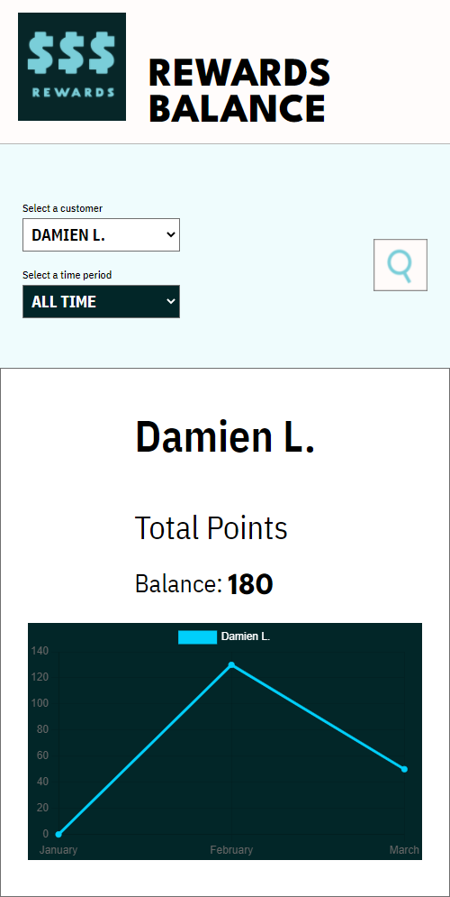

# Rewards Points Dashboard

## Description

A simple-to-use admin dashboard to view customer rewards points data.

 

---

 

## Features

- Mock data is already provided for customer purchases from January through March 2022.

- User can view individual and collective customer rewards points data complete with graph representation of data.

- User can specify month by month or all-time rewards points data.

 

---

 

## Usage

- To use the application, please clone down the repository, install dependencies, and then run npm run start from the root directory.

 

---

 

## Behind The Scenes

Customer rewards points are calculated as follows:

+ Customer receives 2 points for every dollar spent over $100 in a given transaction
+ Customer receives an additional point for every dollar spent over $50 in a single transaction
+ Ex: $120 purchase --> 2x$20 + 1X$50 = 90 Rewards Points

 

---

 

## Screenshot

 

 

---

### License

 

MIT

 

---

### Contact

 

Please feel free to reach out to me at damientluzzo@gmail.com

 